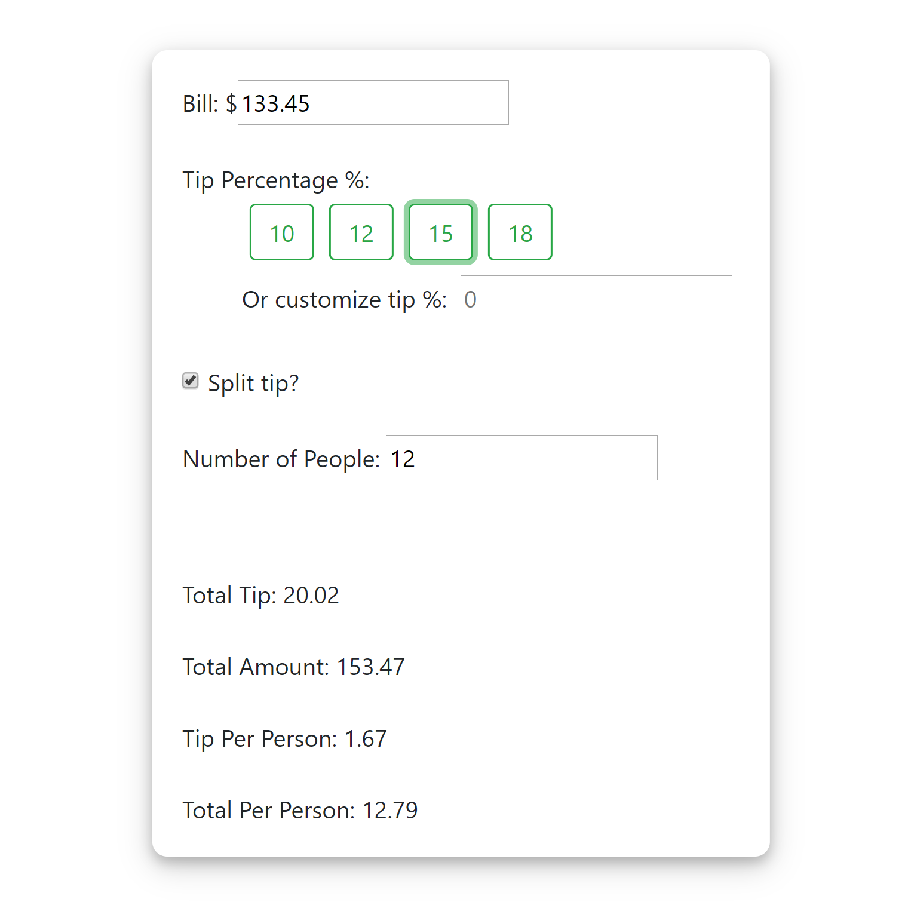

# Tip-Calculator

It's always tricky to know how much to tip, unless you're an arithmetic mastermind! This React application calculates the amount of tip per table, and even per person if split option is chosen. The tip calculator keeps track of the user input without a submit button. 

## Getting Started
This part will get you a copy of the project up and running on your local machine for development and testing purposes.

This is a React application. After cloning the project from Github, enter `npm install` in terminal inside Tip-Calculator directory. To run this project, enter `yarn start`.

## Usage Example
This tip calculator:

* Takes in the value of the bill

* Takes in the desired tip percentage

* Includes the option to split the tip amount by number of people at the table

* The application then calculates the amount of tip per table (or per person if the split option is chosen) and returns that value to the user.

### Error Handling
* Only allow digits enter as inputs
    * no letters, special characters, and negative signs, etc.

## Deployed to Github
Check out this project here: https://huwu55.github.io/Tip-Calculator/

## Meta

Huiling Wu 
* huwu@ucdavis.edu
* https://github.com/huwu55
* https://www.linkedin.com/in/huwu55/